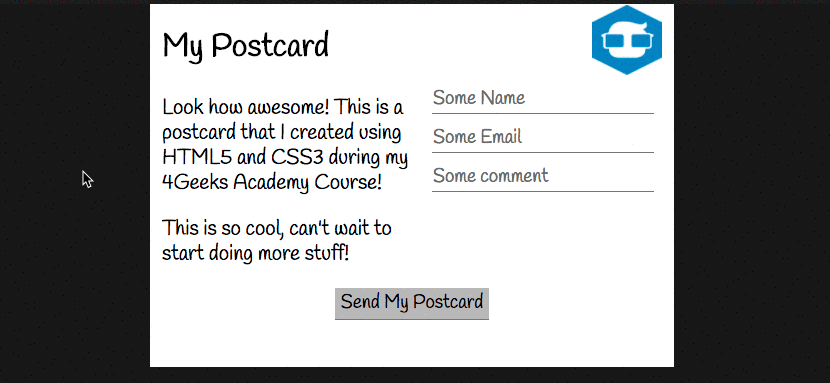

# `12.1` Body Content

What elements should be inside the `postcard-body`? Can you try and identify based on the HTML `<tags>` we mentioned earlier?

💻 Possible options: Headings (h1, h2, h3, etc.), Paragraphs, Images, Divisions, Inputs, Checkbox, etc.



Now we need to create the necessary HTML tags to finish the content of your `.postcard` and apply the missing styles to make them look like the image.

## 📝 Instructions:

1. The first `<p>` does not need a `margin-top`. So you should remove it.

```css
.body-left p:first-child {
	margin-top: x;
}
```

2. The `.body-left` and `.body-right` must have `padding` to separate text from the edges of the boxes.

```css
.body-left,
.body-right {
	padding: x;
}
```

3. The inputs should have a `border-bottom` in `grey` but no borders on the sides and top, try with `border: none` and then `border-bottom`.

```css
input {
	border: x;
	border-bottom: x;
}
```

4. The paragraphs may have a particular `font-size`.

## Expected Result:

+ This is how your website should look like so far:


## 💡 Hint:

+ Think about the layout for those tags. The inputs are going to be one on top of each other.
+ This incredible reading will show you everything you need to know about the `<input> tag` to successfully complete the exercise. https://www.w3schools.com/tags/tag_input.asp
